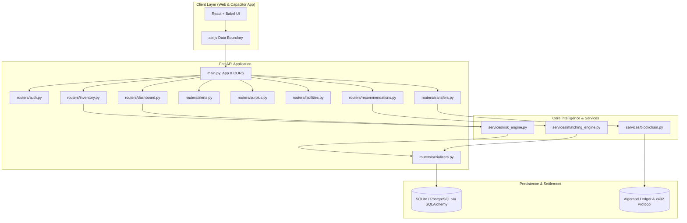
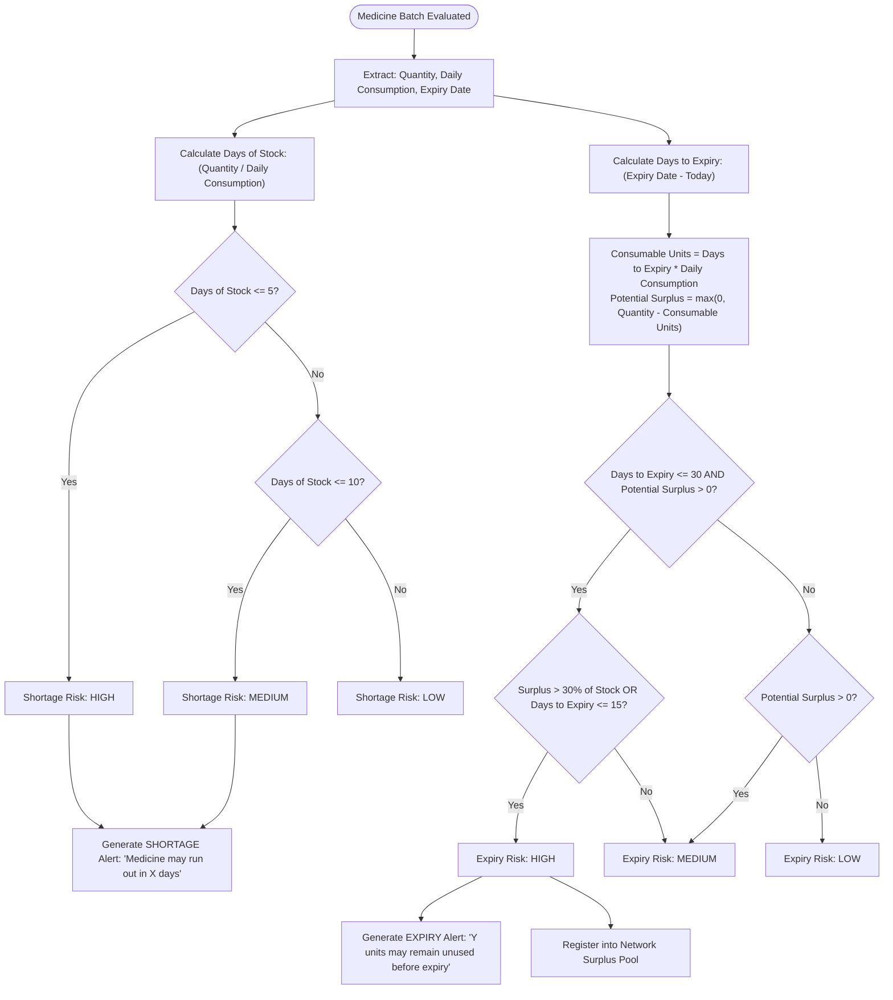
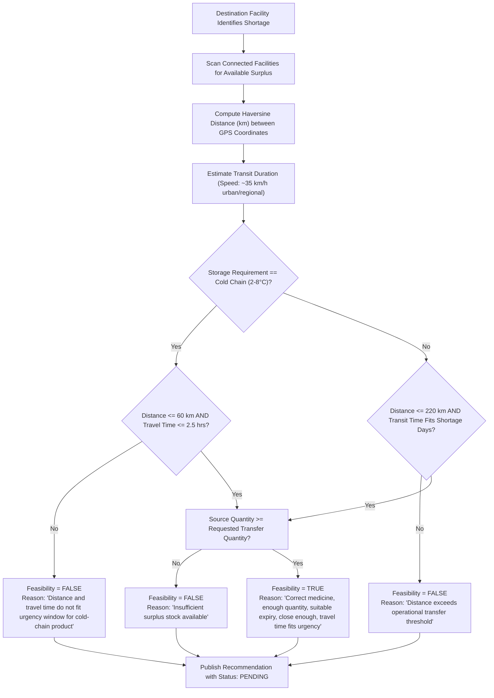
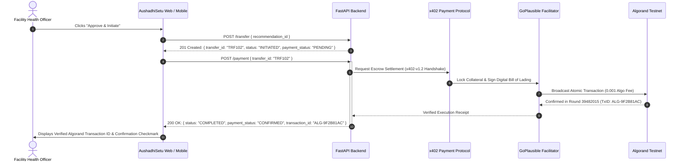

# AushadhiSetu — System Architecture & Workflow Flowcharts

> **Right Medicine · Right Facility · Right Time**
> A network that spots shortages before they happen and coordinates surplus redistribution across connected healthcare facilities with verifiable cryptographic settlement.

---

## 1. High-Level System Architecture

---

## 2. Risk Engine Workflow (AI Shortage & Expiry Predictor)

The predictive risk engine analyzes consumption rates and expiration dates to proactively classify stock levels.

---

## 3. Spatial Matching & Logistics Feasibility Engine

Coordinates surplus inventory with shortage facilities while validating cold-chain temperature thresholds and delivery horizons.

---

## 4. Blockchain & Settlement Pipeline (x402 → GoPlausible → Algorand)

Executes instant, verifiable medical cargo handoffs without traditional clearing delays.

